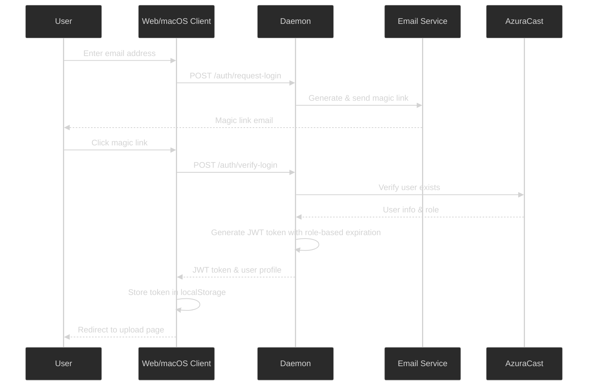
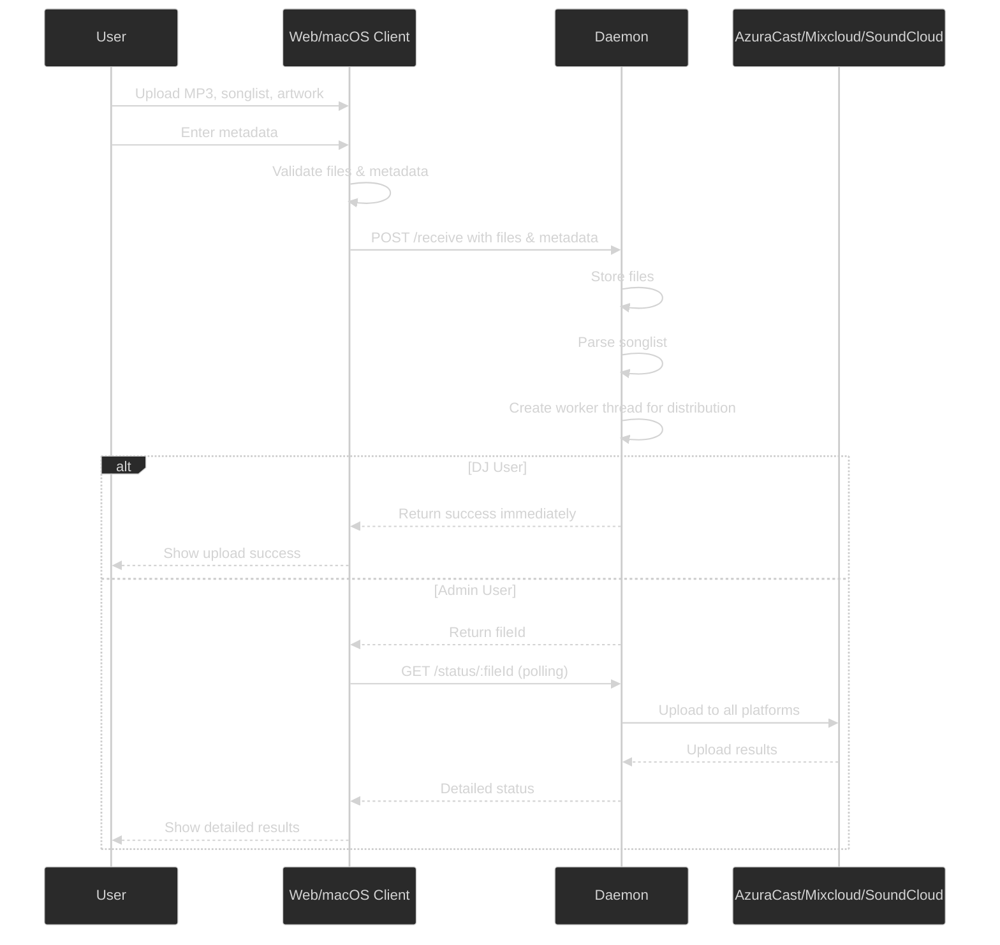
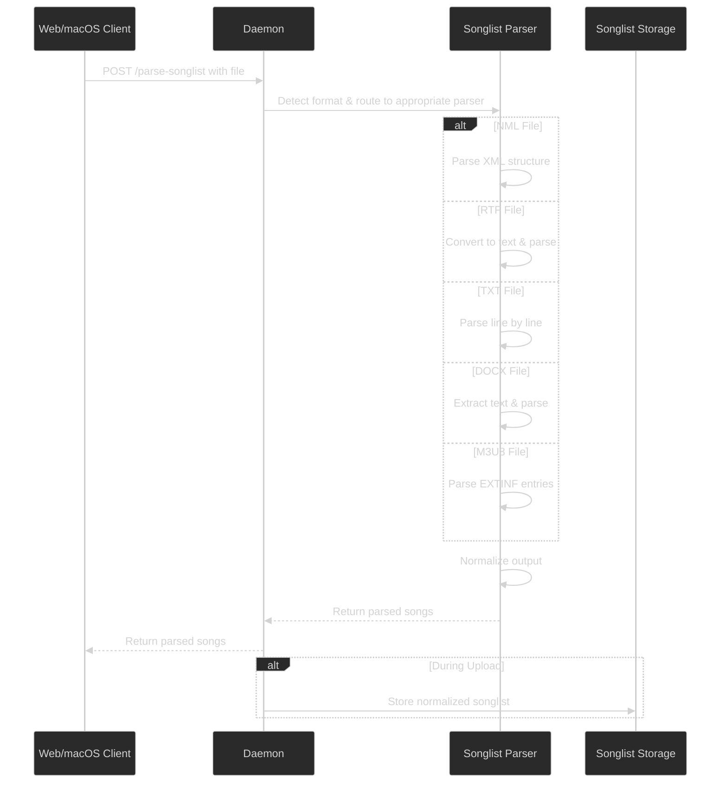
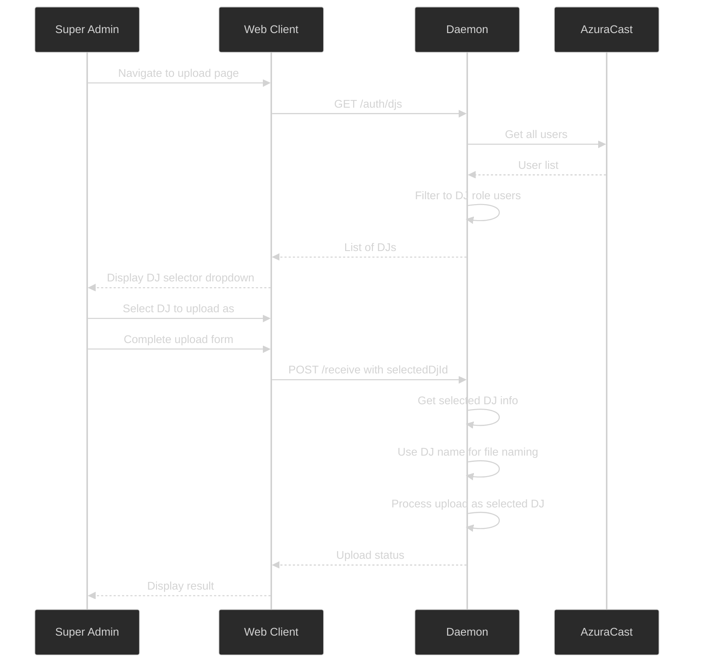

# Architecture Flow Diagrams

This document provides visual representations of key flows within the Upload Distributor system.

## Authentication Flow

## Upload Flow

## Songlist Parsing Flow

## DJ Selector Flow (Super Admin Only)

