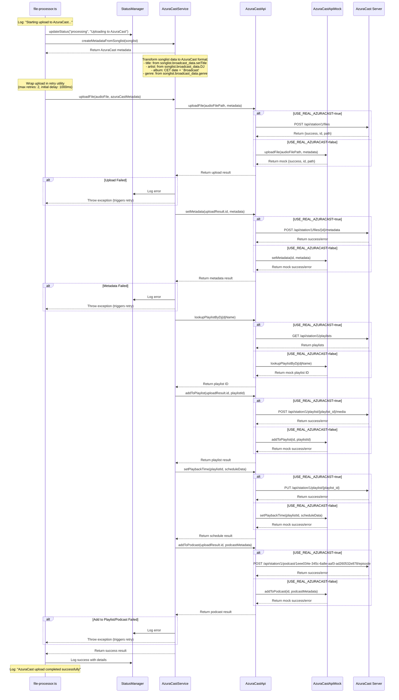

# AzuraCast Upload Flow Diagram

This diagram illustrates the flow of data and processes involved in uploading files to AzuraCast from the Upload Distributor daemon, from the point where "Starting upload to AzuraCast..." is logged to "AzuraCast upload completed successfully".

## Flow Diagram

## Key Components

1. **file-processor.ts**: Initiates the upload process and handles the overall flow
2. **StatusManager**: Updates and tracks the status of the upload process
3. **AzuraCastService**: Orchestrates the three-step upload process and handles retries
4. **AzuraCastApi**: Interface for communicating with the AzuraCast server
5. **AzuraCastApiMock**: Mock implementation for development/testing
6. **AzuraCast Server**: The actual AzuraCast server that receives the uploads

## Implementation Notes

- The system uses a configuration flag (`USE_REAL_AZURACAST`) to toggle between real API calls and mock behavior
- The upload process is wrapped in a retry mechanism with up to 2 retries
- The podcast ID (1eee034e-345c-6a8e-aaf3-ad260532e878) was determined through the one-time setup process
- DJ playlists are looked up dynamically by matching the DJ name against playlist names (case-insensitive)
- The system found the following exact DJ-playlist mappings on station 1 (production):
  - Ali → playlist ID 50 (Ali)
  - Andre Rehage → playlist ID 66 (Andre Rehage)
  - Chewee → playlist ID 1 (Chewee)
  - DJ Takafusa → playlist ID 9 (DJ Takafusa)
  - GIUGRI.J → playlist ID 39 (GIUGRI.J)
  - Ian Douglass → playlist ID 16 (Ian Douglass)
  - JIB → playlist ID 61 (JIB)
  - Kate Alderman → playlist ID 45 (Kate Alderman)
  - Liz Dreher → playlist ID 44 (Liz Dreher)
  - Moody Silvs → playlist ID 58 (Moody Silvs)
  - Paul Sweeney → playlist ID 65 (Paul Sweeney)
  - phr0ggi → playlist ID 60 (Phr0ggi)
  - Trafelo → playlist ID 11 (Trafelo)
- The process follows a phased integration approach as outlined in the implementation plan
